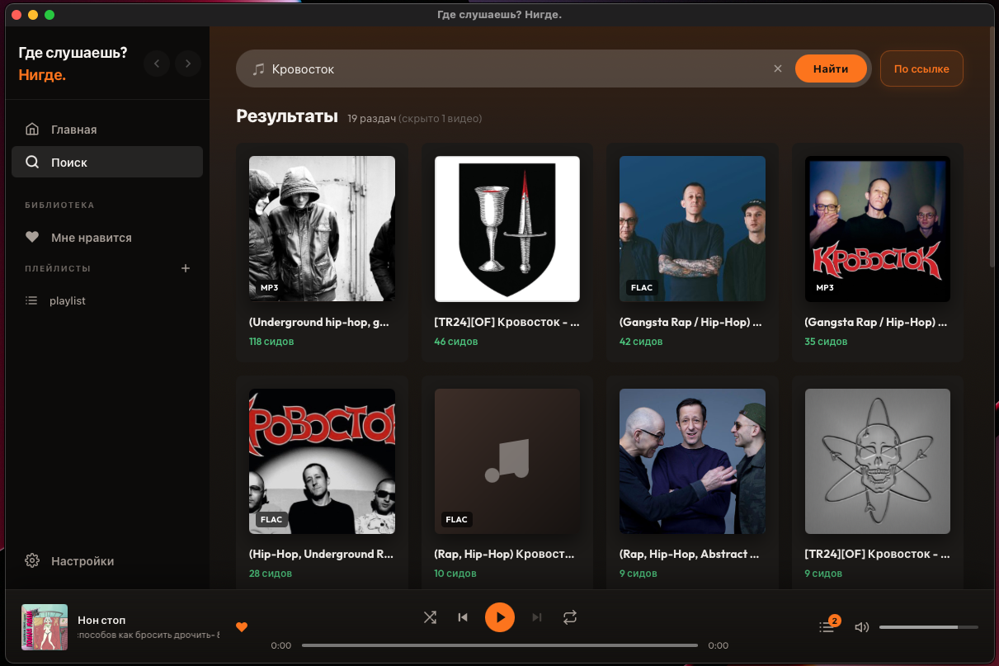
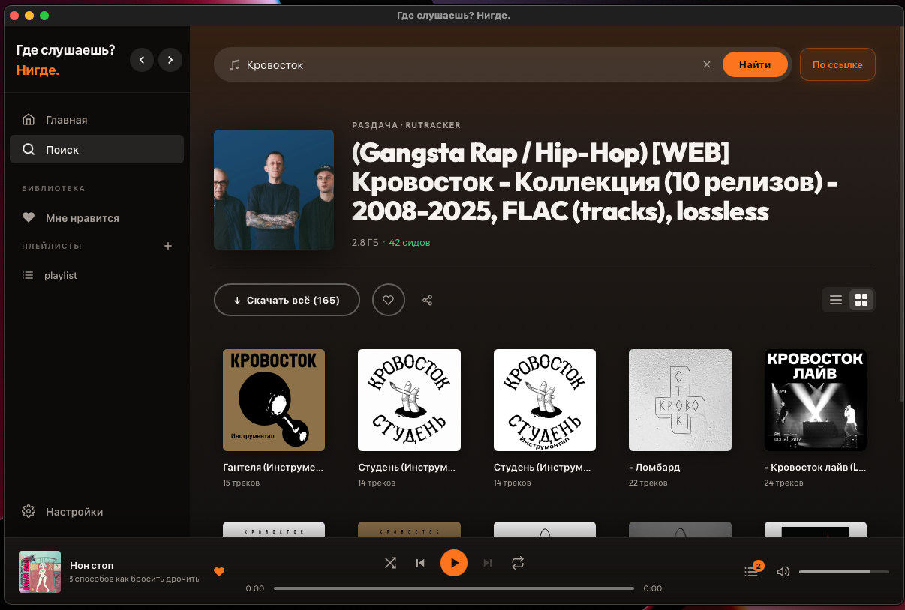

# neegde

Десктопный плеер. Стримит из BitTorrent и SoulSeek, не скачивая альбом целиком.

<p align="center"></p>
<p align="center"></p>

**Источники:** RuTracker + SoulSeek в одной выдаче.  
**Движок:** [vozduxan](https://github.com/neegde/vozduxan) (C++ / libtorrent) — торренты; нативный Rust — SoulSeek.  
**Хранилище:** только localStorage. Никаких серверов.

## Сборка

```bash
# macOS
brew install libtorrent-rasterbar

# Ubuntu
sudo apt-get install libtorrent-rasterbar-dev cmake

git clone --recurse-submodules https://github.com/neegde/neegde-tauri.git
cd neegde-tauri
npm install
cargo tauri dev
```

Требования: Node 20+, Rust stable, CMake 3.20+.

Быстрая проверка типов без C++: `cargo check`

## Документация

**[wiki.neegde.ru](https://wiki.neegde.ru)** — архитектура, протоколы, стриминг, persistence.

Баги и PR — в [Issues](https://github.com/neegde/neegde-tauri/issues).

## Лицензия

[GNU General Public License v3.0](LICENSE) (или более поздней версии, на ваш выбор).
