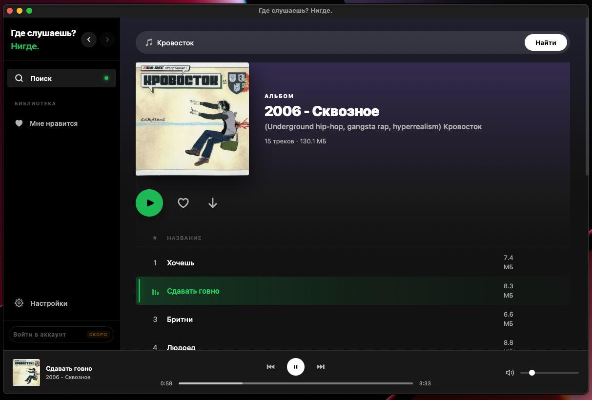
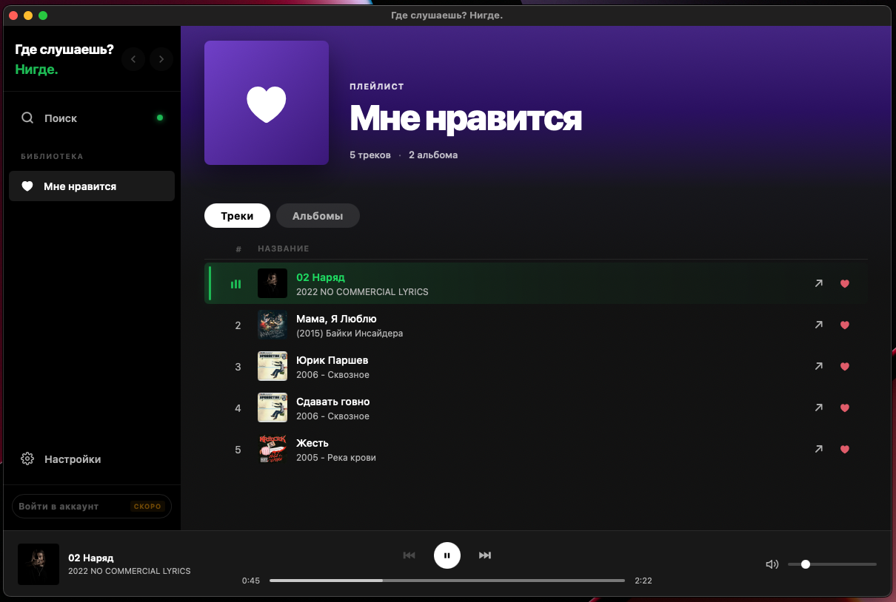
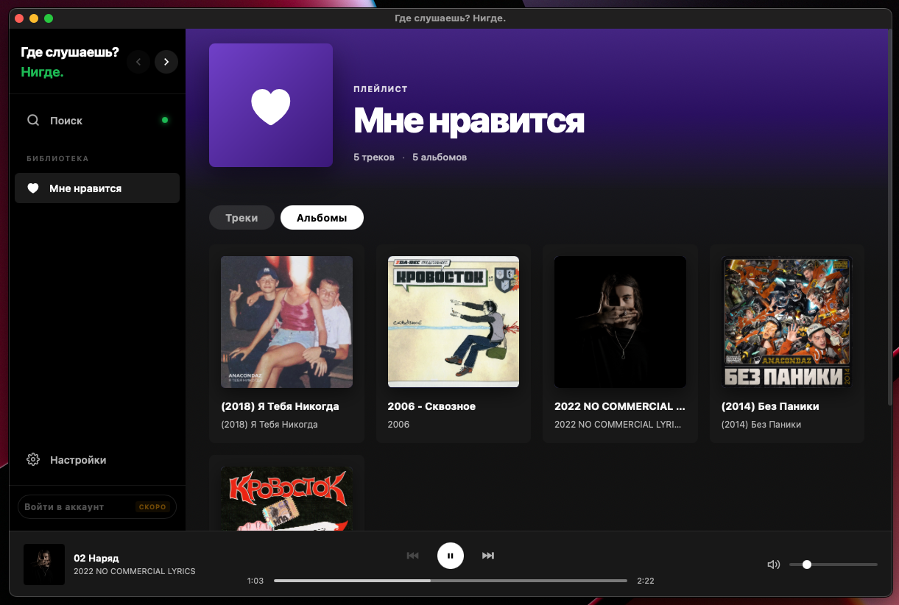
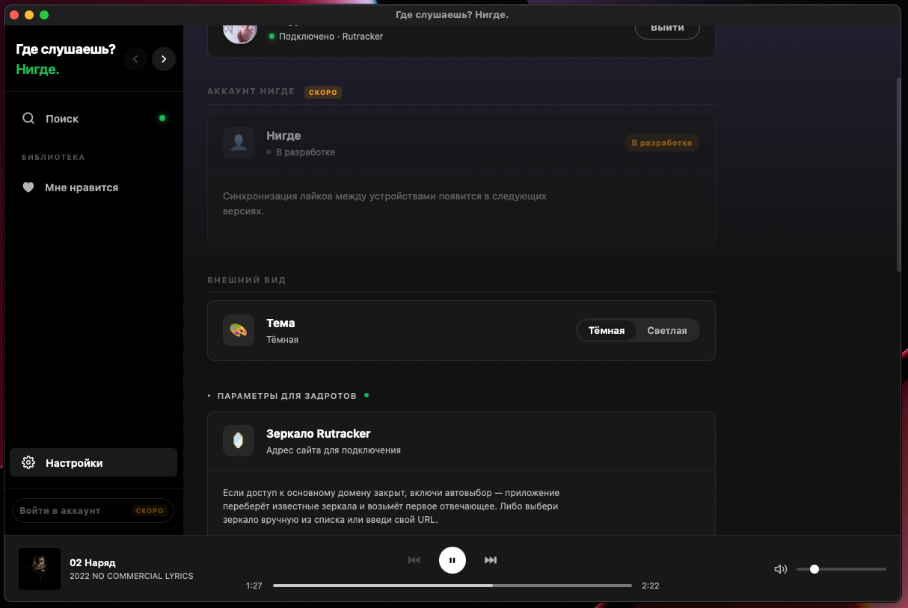

# Где слушаешь? Нигде.

Десктопный музыкальный плеер, который стримит аудио из торрент-роев и по желанию из сети **SoulSeek** (P2P). По умолчанию не кладёт альбом целиком на диск — играет по мере загрузки. Никаких подписок и своих серверов: BitTorrent, SoulSeek и немного наглости.

Поиск — **RuTracker** и/или **SoulSeek** в одной выдаче с вкладками. Поток из торрентов гонит [vozduxan](https://github.com/neegde/vozduxan) (libtorrent); SoulSeek идёт отдельным нативным слоем.

<p align="center"></p>
<p align="center"></p>
<p align="center"></p>
<p align="center"></p>
<p align="center"></p>
<p align="center"></p>

---

## Возможности

### Стриминг без полной загрузки
Треки из **торрентов** идут прямо из роя по мере загрузки кусков: локальный HTTP с Range-запросами, нормальная перемотка. **SoulSeek** стримит выбранный файл с чужого клиента по протоколу сети — тоже без скачивания «всего альбома» ради одного трека.

### Префетч очереди
Пока играет текущий трек, плеер **подогревает следующий** (и ещё один за ним), чтобы переключения в очереди были быстрее. Отдельно от этого в интерфейсе показывается статистика буфера/скорости там, где это уместно для торрент-стрима.

### Поиск
- **RuTracker**: поиск с кэшем последних 30 запросов; авторизация логин/пароль, сессия между запусками; зеркала (rutracker.net, .org, .nl, .cr, .lib, maintracker.org) — авто или вручную; HTTP-прокси (два пресета или свой).
- **SoulSeek** (включается в настройках): отдельная P2P-сеть, не RuTracker — свой логин/пароль в настройках; поиск по шаре, группировка результатов, обложки где есть; лайки и очередь как у торрент-треков, со своими метаданными.
- Если включены **оба источника**, общая выдача с **вкладками** (в т.ч. торренты без звука можно отфильтровать).

### Плеер
- Очередь треков с восстановлением позиции после перезапуска
- Перемотка, громкость, предыдущий/следующий
- 10-полосный графический эквалайзер (32 Гц — 16 кГц, ±12 дБ) с 10 пресетами и своими настройками
- Опциональные **визуализации** (в том числе в **отдельном окне**, если хочется)
- Media Session API — управление через системные медиа-кнопки и экран блокировки
- Discord Rich Presence — показывает что играет
- Кнопка лайка прямо в плеере

### Браузер раздач
- Список треков с форматом, размером, длительностью
- Группировка по альбомам, режимы отображения список/галерея
- Обложки с лайтбоксом
- Значки форматов (FLAC, MP3, OGG, WAV, …)

### Библиотека
Три раздела: Треки, Альбомы, Раздачи. Лайкнутое сохраняется локально — никаких аккаунтов.

### Экспорт и загрузка на диск
Скачать отдельный трек, альбом или всё из **торрент-раздачи** в выбранную папку — с прогрессом и сохранением структуры папок. Отдельно можно **выгрузить плейлист** или треки из **SoulSeek** на диск, если нужен офлайн-файл, а не стрим.

### Настройки и кэш
- Максимальный размер кэша (50–8192 МиБ) и TTL (5 мин–14 дней)
- Очистка кэша стримов и обложек
- Тёмная / светлая / системная тема
- Дебаг-консоль с фильтрами и экспортом лога
- Диагностика: память, пути, размеры кэшей, активные стримы
- По желанию: включаемые **достижения** и сопутствующие пасхалки в интерфейсе

---

## Установка

Скачай последний билд под свою платформу на [странице релизов](https://github.com/neegde/neegde-tauri/releases).

Для поиска и скачивания с **RuTracker** нужен аккаунт на форуме. **SoulSeek** — отдельная регистрация в той сети; вводишь логин и пароль в настройках приложения, если включаешь этот источник.

---

## Обратная связь

Баги и предложения — в [Issues](https://github.com/neegde/neegde-tauri/issues) или в [тгк](https://t.me/youthcode).


## For developers

### Stack

| Layer | Tech |
|-------|------|
| Frontend | Vue 3 (Composition API, `<script setup>`) + Vite 6 |
| Desktop shell | Tauri 2 |
| Rust backend | reqwest, tokio, serde |
| Streaming engine | [vozduxan](https://github.com/neegde/vozduxan) — C++ static lib wrapping libtorrent-rasterbar |

No UI frameworks — all styles are hand-written CSS with dark/light theme via CSS variables.

### Project layout

```
src/
  App.vue                   top-level: view state, queue, stream coordination
  style.css                 CSS variables (dark/light theme)
  components/
    player/Player.vue       audio element, EQ graph, media session, stream status popup
    search/                 SearchBar, Results grid, AlbumCard
    torrent/TorrentView.vue tracklist, album grouping
    likes/LikesView.vue     liked tracks / albums / torrents tabs
    settings/SettingsView.vue
    shell/                  NavArrows, AppAuthPanel, DownloadProgressOverlay
    shared/                 CoverThumb, CoverLightbox, PlayingIndicator
    debug/AppDebugConsole.vue
  torrent/
    api.js                  streamUrl() — торренты и SoulSeek; prefetchNextInQueue()
    torrentSession.js       Tauri invoke wrappers, vozduxanNotifyPosition()
  soulseek/
    api.js                  поиск, prepare/release stream, экспорт на диск
    coverCache.js, slskMetaStore.js
  audio/
    equalizerGraph.js       Web Audio API: 10 BiquadFilterNode chain
    equalizerState.js       gain state + localStorage persistence
    equalizerConfig.js      preset definitions
  rutracker/                auth, search, cover cache, mirror/proxy config
  library/                  likes storage, likesCover

src-tauri/src/
  lib.rs                    Tauri setup, managed state, invoke_handler
  vozduxan_ffi.rs           raw unsafe C bindings to vozduxan
  vozduxan_stream.rs        safe Rust wrapper + торрент-стриминг Tauri commands
  soulseek/                 логин, поиск, стрим, обложки, экспорт файла
  rutracker/                Rust HTTP login (CP1251), search, torrent topic parser
  torrent_stream/           legacy full-download/export path (librqbit)
    export.rs               torrent_export_files + progress events
    debug_log.rs            AppDebugLog — ring buffer + Tauri event emitter
  cover_art.rs              MusicBrainz + CoverArtArchive fallback
  torrent_image.rs          separate librqbit session for cover image downloading
  nerd_stats.rs             memory/cache diagnostics Tauri command
```

### Streaming architecture

Воспроизведение из **торрентов** идёт через **vozduxan** (C++ + libtorrent). Треки из **SoulSeek** стримятся отдельным Rust-модулем `soulseek/` (не libtorrent). Полный **экспорт торрентов на диск** по-прежнему через `torrent_stream` и **librqbit**.

Submodule **vozduxan** лежит в `vozduxan/`, собирается `cmake`-крейтом в `build.rs`. Готовых бинарников нет — всё из исходников.

**Токены стрима** в `vozduxan_stream.rs`: `current_token` (играет сейчас), `prefetch_token` (следующий в очереди), `warm_prefetch_token` (прогрев через один трек — не вытесняет настоящий prefetch).

Плеер зовёт `prefetchNextInQueue()` из `torrent/api.js`, что мапится на `torrent_prefetch_next_track` в Rust.

### Running locally

```bash
# Prerequisites: Node 20+, Rust stable, CMake 3.20+, libtorrent-rasterbar

# macOS
brew install libtorrent-rasterbar

# Ubuntu
sudo apt-get install libtorrent-rasterbar-dev cmake

# Clone with submodules
git clone --recurse-submodules https://github.com/neegde/neegde-tauri.git
cd neegde-tauri
npm install
cargo tauri dev
```

Fast Rust-only type check: `cargo check`

### Tauri commands (часть; см. `lib.rs`)

**Торренты (vozduxan):** `torrent_prepare_stream`, `torrent_magnet_list_files`, `torrent_prefetch_next_track`, `torrent_prepare_cancel`, `torrent_dispose_preview`, `torrent_release_stream`, `vozduxan_notify_position`, `vozduxan_stream_stats`.

**SoulSeek:** `soulseek_login`, `soulseek_logout`, `soulseek_status`, `soulseek_search`, `soulseek_prepare_stream`, `soulseek_release_stream`, `soulseek_cover_preview`, сохранение учётных данных, `soulseek_export_file` / `soulseek_export_cancel`.

**Экспорт торрентов (librqbit):** `torrent_export_files`, `torrent_export_cancel`.

### Key invariants

- Общий журнал отладки живёт в `TorrentStreamState`; `VozduxanStreamState::new` получает тот же `Arc<AppDebugLog>` через `ts.debug_log()` (см. комментарий в `lib.rs`)
- `cargo:rerun-if-changed` в `build.rs` перечисляет отдельные файлы C++ в vozduxan — mtime каталога на macOS при правке файла внутри не обновляется
